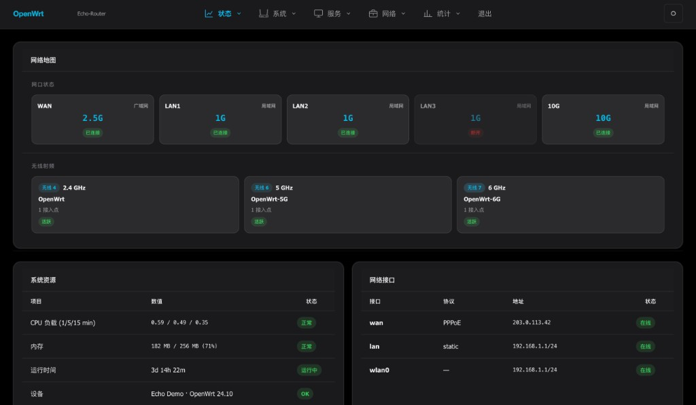

# luci-theme-echo

[](https://github.com/Jas0n0ss/openwrt-theme-echo/actions/workflows/build.yml)

Apple 极简美学 × OpenWrt 仪表盘 — 面向 OpenWrt / ImmortalWrt / LEDE 的现代 LuCI 主题。



**当前版本：** 1.6.0（见 [`ucode/template/themes/echo/version`](ucode/template/themes/echo/version)）

---

## 特性

| 模块 | 说明 |
|------|------|
| **Bootstrap 底座** | 依赖 `luci-theme-bootstrap` 的 `cascade.css`（CBI/表单/组件）；Echo 只覆盖导航与视觉 |
| **顶部导航** | 菜单逻辑对齐 `menu-bootstrap.js`；Echo 下拉式 L1/L2；PC / 移动端自适应 |
| **二级菜单** | 点击主菜单展开下拉后选择 L2（主菜单不直接跳转）；有 L2 时隐藏重复标题 |
| **经典主菜单** | 与 LuCI 一致：状态 / 系统 / 服务 / 网络 / 统计 / 插件… / 退出 |
| **Network Map** | 按设备自适应：board.json / 内置网口 / 实时链路；无线读 iwinfo，无硬件则隐藏模块 |
| **仪表盘表格** | 系统资源 / 接口 / 流量 / 客户端四表，保留 LuCI 原生详情 |
| **第三方 UI** | `ui-echo.js` 自动美化 luci-app 注入的表格、表单、Modal、Tab |
| **主题配置** | `luci-app-echo-config` 可视化配置预设、颜色、背景 |
| **中文 i18n** | IPK 内置 `zh_Hans` 翻译（`.lmo`），LuCI 语言设为简体中文后生效 |

| **深浅色** | Auto / Light / Dark 三态 |
| **本地 Demo** | 无需路由器即可预览 UI |

---

## 简体中文

IPK 已内置翻译文件（无需单独安装中文包）：

| 文件 | 说明 |
|------|------|
| `luci-theme-echo.zh_Hans.lmo` | 主题界面（菜单、Network Map、仪表盘等） |
| `luci-app-echo-config.zh_Hans.lmo` | 主题配置应用 |

安装 `.ipk` 后，在 LuCI 中设置语言：

**System → System → Language and Style → Language** → 选择 **简体中文 (zh_Hans)**

或使用 UCI：

```bash
uci set luci.main.lang='zh_Hans'
uci commit luci
/etc/init.d/uhttpd restart
```

刷新浏览器即可看到中文界面。

```bash
git clone https://github.com/Jas0n0ss/openwrt-theme-echo.git
cd openwrt-theme-echo
./demo/serve.sh
# 浏览器打开 http://127.0.0.1:8080/demo/
```

---

## 安装

### 方式 A：预编译 .ipk（推荐）

从 [GitHub Actions Artifacts](https://github.com/Jas0n0ss/openwrt-theme-echo/actions) 下载最新构建，或本地构建：

```bash
./scripts/build-ipk.sh
./scripts/verify-ipk.sh

# 上传到路由器：
opkg install dist/luci-theme-echo_*.ipk
opkg install dist/luci-app-echo-config_*.ipk
# luci-theme-echo 依赖 luci-theme-bootstrap（提供 cascade.css）；固件一般已自带

uci set luci.main.mediaurlbase='/luci-static/echo'
uci commit luci
/etc/init.d/uhttpd restart
```

### 方式 B：编译进固件

```bash
cd openwrt/package
git clone https://github.com/Jas0n0ss/openwrt-theme-echo.git luci-theme-echo
cp -r luci-theme-echo/luci-app-echo-config .

make menuconfig
# LuCI → Themes → luci-theme-echo
# LuCI → Applications → luci-app-echo-config

make package/luci-theme-echo/compile V=s
make package/luci-app-echo-config/compile V=s
```

### 启用主题

**System → System → Language and Style → Design** → 选择 **Echo**

### 主题配置

**System → Echo Theme**，或使用 UCI：

```bash
uci set echo.global.preset='openwrt'
uci set echo.global.router_model='OpenWrt'
uci set echo.global.primary='#00B5E2'
uci set echo.global.dashboard='1'
uci commit echo
```

---

## 导航架构

```
┌──────────────────────────────────────────────────────────────┐
│ [Logo]  状态▼  系统▼  服务▼  网络▼  统计▼  …插件…  退出 [主题]│  ← L1（LuCI 顺序）
│              └─ 点击后：概览 / 防火墙 / 路由 …（下拉 L2）       │
├──────────────────────────────────────────────────────────────┤
│           （L3 tabs，仅深层页面 / 插件内页）                  │
├──────────────────────────────────────────────────────────────┤
│  Main Content — CBI 表单、Network Map、仪表盘表格            │
└──────────────────────────────────────────────────────────────┘
```

- **L1**：按 LuCI `order` + 经典顺序排列；第三方插件各自一级菜单
- **L2**：点击 L1 后在下拉中选择；**不重复**显示 `#echo-header` 标题
- **L3+**：插件内页或 network/wifi 等深层 Tab

菜单逻辑见 [`htdocs/luci-static/resources/menu-echo.js`](htdocs/luci-static/resources/menu-echo.js)。

---

## 兼容性

| 固件 | 模板 | 说明 |
|------|------|------|
| OpenWrt 23.05+ / 24.x | `ucode/*.ut` | 推荐 |
| ImmortalWrt | `ucode/*.ut` | 同 OpenWrt 新版 |
| LEDE 18.06 / Lean | `luasrc/view/` | 旧版 Lua 模板（功能较简） |

---

## 开发与构建

```bash
# 构建 IPK
./scripts/compile-i18n.sh   # 编译 po → lmo（build-ipk 会自动调用）
./scripts/build-ipk.sh

# 校验包内容与版本
./scripts/verify-ipk.sh

# 拉取 OpenWrt 风格菜单图标（可选）
./scripts/fetch-menu-icons.sh
```

### 项目结构

```
openwrt-theme-echo/
├── .github/workflows/build.yml   # CI：构建 + 校验 + 上传 Artifacts
├── htdocs/luci-static/
│   ├── echo/css/                 # 样式（layout, glass, dashboard…）
│   ├── echo/icons/menu/          # SVG 菜单图标
│   └── resources/
│       ├── menu-bootstrap-core.js # 与 bootstrap 一致的菜单规则
│       ├── menu-echo.js          # Echo 顶栏 DOM + 点击下拉 L2 + L3 tabs
│       ├── echo/css/bootstrap-compat.css  # cascade 变量桥接
│       ├── ui-echo.js            # 第三方 luci-app UI 增强
│       ├── dashboard-echo.js     # 概览 Network Map + 表格
│       └── theme-echo.js         # 深浅色切换
├── ucode/template/themes/echo/   # header.ut / footer.ut / sysauth.ut
├── luci-app-echo-config/         # 主题配置 LuCI 应用
├── po/zh_Hans/                   # 简体中文翻译
├── demo/                         # 静态 UI 预览
├── scripts/                      # build-ipk.sh, compile-i18n.sh, verify-ipk.sh
└── root/etc/config/echo          # 默认 UCI
```

代码审查说明见 [CODE_REVIEW.md](./CODE_REVIEW.md)，设计规范见 [DESIGN.md](./DESIGN.md)。

---

## CI 与 Release

推送至 `main` / `master`、打 `v*` 标签或手动触发时自动：

1. `./scripts/build-ipk.sh` 构建安装包
2. `./scripts/verify-ipk.sh` 校验包内资源
3. 上传 Actions Artifacts（保留 30 天）
4. **发布到 [GitHub Releases](https://github.com/Jas0n0ss/openwrt-theme-echo/releases)**，附带两个 `.ipk`

| 触发方式 | Release 标签 |
|----------|--------------|
| 推送到 `main` | `v{version}`（读取 `ucode/template/themes/echo/version`） |
| 推送标签 `v1.5.11` | 使用该标签名 |
| PR | 仅构建校验，不发布 Release |

手动触发：**Actions → Build IPK → Run workflow**

---

## License

[Apache License 2.0](LICENSE)
