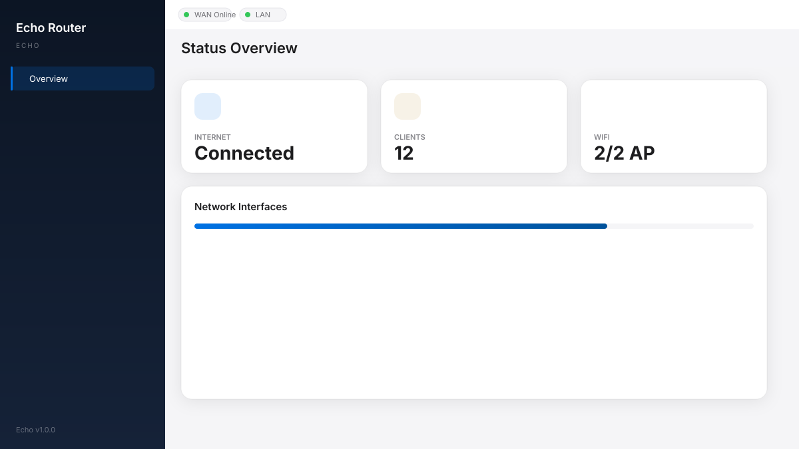

# luci-theme-echo

[](https://github.com/Jas0n0ss/openwrt-theme-echo/actions/workflows/build.yml)

Apple 极简美学 × OpenWrt 仪表盘 — 面向 OpenWrt / ImmortalWrt / LEDE 的现代 LuCI 主题。



**当前版本：** 1.5.11（见 [`ucode/template/themes/echo/version`](ucode/template/themes/echo/version)）

---

## 特性

| 模块 | 说明 |
|------|------|
| **顶部导航** | 主菜单居中，Bootstrap 风格；PC / 移动端自适应 |
| **二级菜单** | 系统分区（状态 / 网络 / 系统）显示 L2；有二级菜单时隐藏重复页面标题 |
| **智能分组** | VPN 类插件归入 **VPN** 主菜单；其余第三方插件归入 **软件** |
| **Network Map** | 概览页网口 + 无线射频卡片，中文 i18n |
| **仪表盘表格** | 系统资源 / 接口 / 流量 / 客户端四表，保留 LuCI 原生详情 |
| **第三方 UI** | `ui-echo.js` 自动美化 luci-app 注入的表格、表单、Modal、Tab |
| **主题配置** | `luci-app-echo-config` 可视化配置预设、颜色、背景 |
| **深浅色** | Auto / Light / Dark 三态 |
| **本地 Demo** | 无需路由器即可预览 UI |

---

## 快速预览

```bash
git clone https://github.com/Jas0n0ss/openwrt-theme-echo.git
cd openwrt-theme-echo
./demo/serve.sh
# 浏览器打开 http://127.0.0.1:8080/demo/
```

---

## 安装

### 方式 A：预编译 .ipk（推荐）

从 [GitHub Actions Artifacts](https://github.com/Jas0n0ss/openwrt-theme-echo/actions) 下载最新构建，或本地构建：

```bash
./scripts/build-ipk.sh
./scripts/verify-ipk.sh

# 上传到路由器：
opkg install dist/luci-theme-echo_*.ipk
opkg install dist/luci-app-echo-config_*.ipk

uci set luci.main.mediaurlbase='/luci-static/echo'
uci commit luci
/etc/init.d/uhttpd restart
```

### 方式 B：编译进固件

```bash
cd openwrt/package
git clone https://github.com/Jas0n0ss/openwrt-theme-echo.git luci-theme-echo
cp -r luci-theme-echo/luci-app-echo-config .

make menuconfig
# LuCI → Themes → luci-theme-echo
# LuCI → Applications → luci-app-echo-config

make package/luci-theme-echo/compile V=s
make package/luci-app-echo-config/compile V=s
```

### 启用主题

**System → System → Language and Style → Design** → 选择 **Echo**

### 主题配置

**System → Echo Theme**，或使用 UCI：

```bash
uci set echo.global.preset='openwrt'
uci set echo.global.router_model='OpenWrt'
uci set echo.global.primary='#00B5E2'
uci set echo.global.dashboard='1'
uci commit echo
```

---

## 导航架构

```
┌──────────────────────────────────────────────────────────────┐
│ [Logo]     状态  网络  系统  VPN  软件     [主题] [退出]      │  ← L1 主菜单
├──────────────────────────────────────────────────────────────┤
│           概览   路由   防火墙                               │  ← L2 二级（仅多子项时）
├──────────────────────────────────────────────────────────────┤
│           （L3 tabs，仅深层页面 / 插件内页）                  │
├──────────────────────────────────────────────────────────────┤
│  Main Content — CBI 表单、Network Map、仪表盘表格            │
└──────────────────────────────────────────────────────────────┘
```

- **L1**：OpenWrt 系统项 + 虚拟分组（VPN / 软件）
- **L2**：当前分区子页面；**不重复**显示 `#echo-header` 标题
- **L3+**：插件内页或 network/wifi 等深层 Tab

菜单逻辑见 [`htdocs/luci-static/resources/menu-echo.js`](htdocs/luci-static/resources/menu-echo.js)。

---

## 兼容性

| 固件 | 模板 | 说明 |
|------|------|------|
| OpenWrt 23.05+ / 24.x | `ucode/*.ut` | 推荐 |
| ImmortalWrt | `ucode/*.ut` | 同 OpenWrt 新版 |
| LEDE 18.06 / Lean | `luasrc/view/` | 旧版 Lua 模板（功能较简） |

---

## 开发与构建

```bash
# 构建 IPK
./scripts/build-ipk.sh

# 校验包内容与版本
./scripts/verify-ipk.sh

# 拉取 OpenWrt 风格菜单图标（可选）
./scripts/fetch-menu-icons.sh
```

### 项目结构

```
openwrt-theme-echo/
├── .github/workflows/build.yml   # CI：构建 + 校验 + 上传 Artifacts
├── htdocs/luci-static/
│   ├── echo/css/                 # 样式（layout, glass, dashboard…）
│   ├── echo/icons/menu/          # SVG 菜单图标
│   └── resources/
│       ├── menu-echo.js          # 顶部 / 二级 / L3 菜单 + VPN/软件分组
│       ├── ui-echo.js            # 第三方 luci-app UI 增强
│       ├── dashboard-echo.js     # 概览 Network Map + 表格
│       └── theme-echo.js         # 深浅色切换
├── ucode/template/themes/echo/   # header.ut / footer.ut / sysauth.ut
├── luci-app-echo-config/         # 主题配置 LuCI 应用
├── po/zh_Hans/                   # 简体中文翻译
├── demo/                         # 静态 UI 预览
├── scripts/                      # build-ipk.sh, verify-ipk.sh
└── root/etc/config/echo          # 默认 UCI
```

代码审查说明见 [CODE_REVIEW.md](./CODE_REVIEW.md)，设计规范见 [DESIGN.md](./DESIGN.md)。

---

## CI

推送至 `main` / `master` 或 PR 时自动：

1. `./scripts/build-ipk.sh`
2. `./scripts/verify-ipk.sh`
3. 上传 `dist/*.ipk` 为 Artifacts（保留 30 天）

手动触发：**Actions → Build IPK → Run workflow**

---

## License

[Apache License 2.0](LICENSE)
